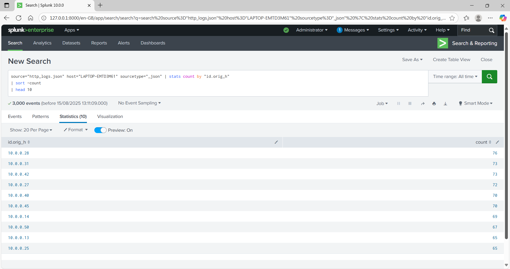
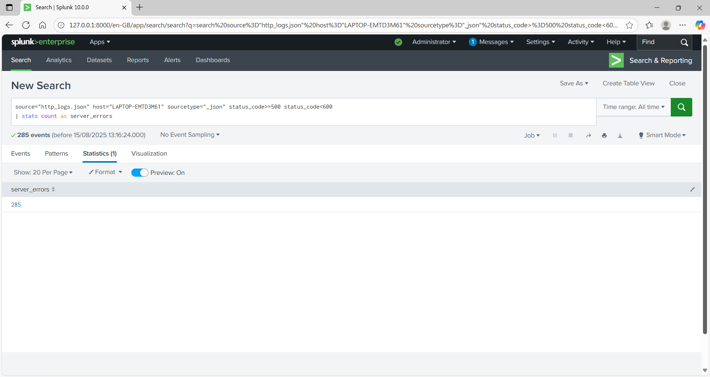
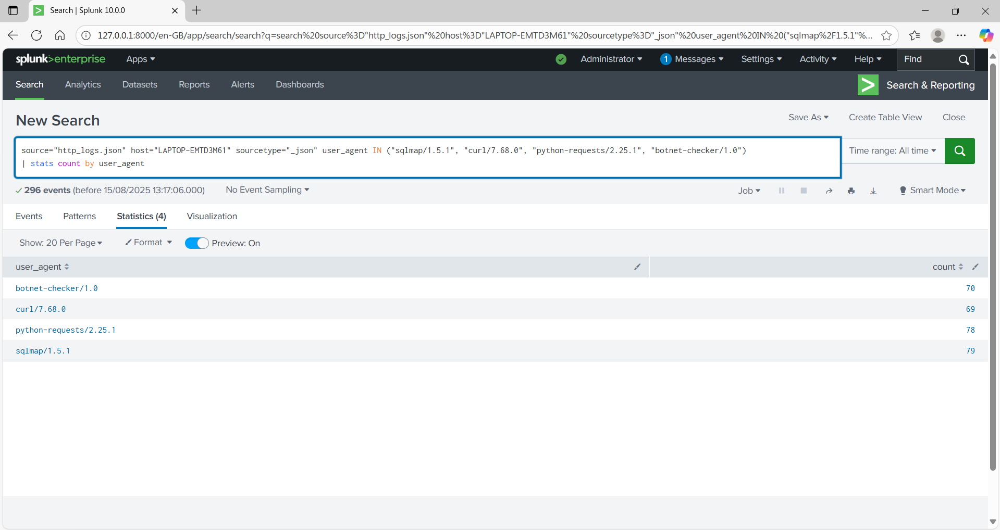
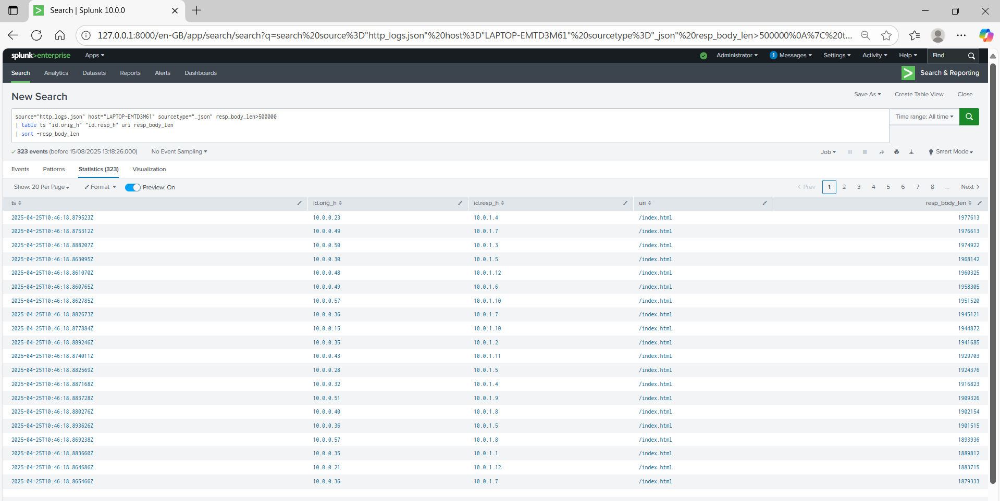

# HTTP Log Analysis with Splunk

## Overview
This project demonstrates my ability to ingest, query, and analyse HTTP logs in **Splunk** to detect patterns, errors, and suspicious activity.  
The dataset consisted of **JSON-formatted Zeek-style HTTP logs**, which simulate server and client communications for training purposes.  

**Learning objectives:**
- Ingest and analyse HTTP logs using Splunk.
- Detect client errors, server errors, and suspicious web activity.
- Identify large file transfers and unusual URI access patterns.

---

## Dataset
- **Format:** JSON
- **Source:** Simulated Zeek-style HTTP logs
- **Fields include:** Timestamp (`ts`), source IP (`id.orig_h`), destination IP (`id.resp_h`), URI, HTTP status codes, response body length (`resp_body_len`), user-agent strings, and more.

---

## Task 1 – Top 10 Endpoints Generating Web Traffic
**Query:**
```spl
source="http_logs.json" host="LAPTOP-EMTD3M61" sourcetype="_json"
| stats count by "id.orig_h"
| sort - count
| head 10
```

**Explanation:**
- `stats count by "id.orig_h"` counts the number of events per source IP (originating host).
- `sort - count` sorts results in descending order by count (the minus sign indicates descending).
- `head 10` limits the output to the top 10 results.

**Why this matters:**
This reveals the most active clients in the network, which is important for spotting unusual spikes in activity that could indicate scanning, exfiltration, or compromised hosts.

**Result:**
Top IP was `10.0.0.28` with 76 events, closely followed by `10.0.0.31` and `10.0.0.42` with 73 each.

**Screenshot:**


## Task 2 – Counting Server Errors (5xx)
**Query:**
```spl
source="http_logs.json" host="LAPTOP-EMTD3M61" sourcetype="_json"
status_code>=500 status_code<600
| stats count as server_errors
```

**Explanation:**
- Filters HTTP responses with status codes between `500` and `599` (server-side errors).
- `stats count as server_errors` counts the total and renames the field for clarity.

**Why this matters:**
Frequent server errors can indicate application issues, misconfiguration, or even attacks attempting to crash a service.

**Result:**
`285` server error events detected in the dataset — indicating a significant number of failed server responses during the logging period.

**Screenshot:**


## Task 3 – Detecting Suspicious User Agents
**Query:**

```spl
source="http_logs.json" host="LAPTOP-EMTD3M61" sourcetype="_json"
user_agent IN ("sqlmap/1.5.1", "curl/7.68.0", "python-requests/2.25.1", "botnet-checker/1.0")
| stats count by user_agent
```

**Explanation:**
- The `IN` clause filters logs where the `user_agent` matches known suspicious tools (e.g., SQLMap, cURL scripts, Python requests).
- `stats count by user_agent` counts how often each appears in the logs.

**Why this matters:**
User agents identify the client software making a request. While normal traffic often comes from browsers (e.g., Mozilla), attackers commonly use automated tools such as SQLMap, cURL, or Python scripts. These patterns highlight scripted probing or potential exploitation attempts.

**Result:**
`sqlmap/1.5.1` → 79 events
`python-requests/2.25.1` → 78 events
`botnet-checker/1.0` → 70 events
`curl/7.68.0` → 69 events

**Screenshot:**


## Task 4 – Identifying Large File Transfers (>500 KB)
**Query:**

```spl
source="http_logs.json" host="LAPTOP-EMTD3M61" sourcetype="_json"
resp_body_len>500000
| table ts "id.orig_h" "id.resp_h" uri resp_body_len
| sort - resp_body_len
```

**Explanation:**
- Filters logs where the `resp_body_len` (size of HTTP response body) exceeds 500 KB.
- `table` displays selected fields for clarity:
- `ts` → Timestamp
- `id.orig_h` → Client/source IP
- `id.resp_h` → Destination/server IP
- `uri` → Requested resource
- `resp_body_len` → Size of the returned content.
- Sorted by largest transfer first.

**Why this matters:**
Large file transfers could indicate legitimate downloads or potential data exfiltration, making this important for detecting insider threats or breaches.

**Result:**
Largest transfer recorded: ~1.97 MB from `10.0.0.23 to 10.0.1.4`.

**Screenshot:**


## Key Concepts Learned
- `stats` command: Used to perform aggregations such as counts, sums, averages, grouped by one or more fields.
- `sort -`: Sorts results in descending order by the specified field.
- `head`: Limits the results to a given number of top entries.
- User-Agent: String that identifies the software (e.g., browser, script, tool) making the HTTP request.
HTTP status codes: Indicators of request results (e.g., 200 OK, 404 Not Found, 500+ Server Errors).
- `resp_body_len`: Length of the HTTP response body in bytes — useful for identifying large transfers.

## Reflections & Takeaways
This lab enhanced my understanding of log analysis in Splunk and sharpened skills that are directly relevant to a Security Analyst role:
- Applying search queries to extract meaningful insights from raw logs.
- Recognising patterns that indicate system issues or malicious activity.
- Understanding how to interpret network communications at the HTTP level.
- Using Splunk's functionality to filter, sort, and visualise security data.

These techniques are essential for working in a Security Operations Centre (SOC), where rapid identification of anomalies can prevent incidents from escalating.
